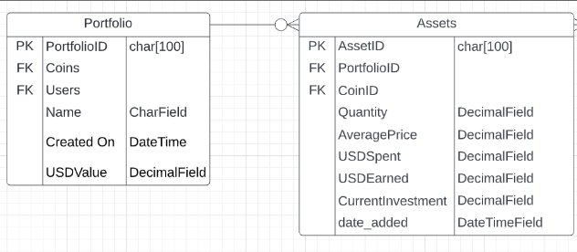

# Cryptics
 
[Cryptics Deployed Site]()

The purpose of Cryptics is to allow users to track their cryptocurrency holdings by utilising the CoinMarketCap API. Users are able to create multiple portfolios where they can add their assets and track the profitability and performance of their holdings.  

Cryptics is a Full Stack Application built with the Django Framework which includes full CRUD funcitionality allowing users to Sign Up / Log In to their account and add, edit or delete portfolios and track their crypto holdings all in one application.

The project is inspired by the [CoinMarketCap Portfolio Tracker](https://coinmarketcap.com/portfolio-tracker/) which is a useful tool I myself use to track my crypto assets. Cryptics aims to provide similar functionality and ease of use as the market leader. 
 
---


---

# User Experience (UX)
 
* ## Vision      
    My vision for Cryptics is to be an application crypto enthusiasts go to if they want to manage their portfolios and track the performance of them. The website is meant to be simple yet effective and provide a real use case to people interested in cryptocurrency. The website will be easy to navigate and I will take a mobile first approach when developing the user interface for the application. I want Cryptics to be responsive and to provide all the necessary features expected in a portfolio tracking application.

* ## Aims
    To provide users an easy to use application they can go to when they want to track and manage their cryptocurrency holdings.  
 
* ## Target Audience
    Cryptocurrency is for everyone! However, the program does require users to have a basic understanding about crypto and portfolio management. Additionally, in the UK you must be at least 18 to own crypto assets as a result, my target audience is for cryptocurrency enthusiasts 18+.
 
* ## User Stories

1. As a **Site User** I will be **directed to the Home Page** so that **I can understand the website**
2. As a **Site User** I can **create an account** so that **I can create a portfolio**
3. As a **Site User** I can **log in to my account** so that **I can view my portfolios**
4. As a **Site User** I can **create an Portfolio** so that **I can track my crypto holdings**
5. As a **Site User** I can **view my Portfolio** so that **I can view the tokens within**
6. As a **Site User** I can **delete my Portfolio** so that **I can remove my portfolio**
7. As a **Site User** I can **search for a token from CoinMarketCap** so that **I can add it to my portfolio**
8. As a **Site User** I can **Sell a token** so that **I can remove it from portfolio**
9. As a **Site User** I can **Buy a token** so that **I can add to my portfolio**


* ## Development Method
    When developing Cryptics I will take an Agile Approach. Meaning I will take an iterative approach to project management and software development helping me to deliver value faster and speed up development time. I will focus on working software over comprehensive documentation and responding to change over following a plan when creating the project.  

* ## Structure
    Cryptics will be developed using Django, as a result I will split the program functionality into separate apps. A Django application is a Python package that is specifically inteded for use in a Django project. For my project I will create three apps; Home, Portfolio and Coin

    Home: This app will contain the code the user will see when they launch the application. It will contain all of the necessary urls and views in order to render the Homepage of Cryptics. This app will also be home to the index.html page which contains the code for the landing page of the project.

    Portfolio: This app will contain all the code needed in order to get the Portfolio functionality working. It will contain the urls and views in order to get the CRUD function of each portfolio which users are then able to add coins into. It will contain the templates needed to display the Portfolio section of the website.

    Coin: This app will contain all the code needed in order to get the coin functionality working. It will contain the urls and views in order to get the CRUD functions of each token working which users can add to their portfolios. It will also contain all the Python files needed in order to access the CoinMarketCap API which will needed when validating and displaying portfolio performance. This app will have the templates needed in order to render the view when a portfolio is chosen.  
 
## Design

* ### Wireframes

    
    
    

* ### ERD Diagram

    

    When creating the database for the website I had to consider the all the data I needed to store in order to have a functioning portfolio tracker. I came to the conclusion that I would need four different relational databases which would interact with one another. The first is the default Django User database, which would store the usernames and passwords of all users which would allow them to login to the site and create portfolios and add tokens. As I didn't need any extra functionality I did not add any custom fields to the database which meant I did not have to add it to my models. 

    The next database was the Portfolio database which had a primary key of PortfolioID, two ForeignKey relationships (Coins and Users) which would allow the portfolio to be connected to a user as well as contain all of the tokens added. The database also had three extra fields being Name (which was the name of the Portfolio), Created On (the date it was created) and finally USDValue (the usd value of their portfolio). This database is the building blocks for the others, as without it, users would be unable to add any assets to their Portfolio so it was vital that this contained all the necessary data. The Portfolio database can be found [here](portfolio/models.py) 

    The third database I created was the Assets database, this would be responsible for holding all the data about a single asset within a single portfolio. This meant, whenever a user wanted to add a new coin to their database, a new instance of the Asset model would be created which would hold all relevant data about that particular coin. The relationship between the Portfolio -> Assets database is a zero-to-many as one portfolio could have zero or many assets within. The model contains a PrimaryKey of AssetID as well as two ForeignKey relationships (PortfolioID and CoinID) which would allow the individual coin to be connect to a particular portfolio. It also contains several other fields which hold data necessary in order to calculate profit and loss for the particular asset. Quantity (the amount of coins), AveragePrice (the average price of each coin bought), USDSpent (total amount of USD spent to purchase coins), USDEarned (profit gained from selling x amount of coins), CurrentInvestment (total amount of money user spent on coins) and finallu data_added (data the asset was added to the portfolio). The Assets database can be found [here](portfolio/models.py) 

    The final database I created was the Coin database, which would hold the information of each individual coin within CoinMarketCap. It had a PrimaryKey of CoinID as well a one ForeignKey relationship to the User database, allowing the coin to be associated with a particular user. It also has one extra field caled Ticker which stores the ticker symbol of the coin allowing it to be displayed on the front-end. The relationship between Assets -> Coin is a one-and-only-one as the min/max amount of Assets a coin can have can only ever be one. This is because a portfolio cannot have two instances of the same coin. The relationship between Coin -> Assets is zero-to-many as an asset can have zero coins (e.g. user doesnt have any BTC) or many (user can have multiple Bitcoins). The Coin database can be found [here](coin/models.py)  

* ### Colour Scheme

    When designing Cryptics I wanted to ensure the colour scheme of my site was visually appealing, I did this by first chosing the main colour which I wanted the majoirty of the site to have. I then used [ColorSpace](https://mycolor.space/) to find colours which compliment it. I decided to go with #661AFF as my primary colour as purple is my favourite colour and I liked the shade of it. By using ColorSpace I chose the Matching Palette which I found most visually appealing which led to my secondary colour being #00B58B, and #B0A8B9 being the tertiary colour. When implementing colours into the site, I went with the 60/30/10 rule which meant #661AFF would make up 60% of the site being the more dominant colour, #00B58B would make up 30% and #B0A8B9 making up 10% being used for accents. Regarding text, black and white were used as these lead to the most readability as well as using white for the background of the pages as I wanted to my site to look professional and not tacky. The colour pallete of the site can be seen below:

    

* ### Typography

    When considering the typography of the site, I wanted to use fonts that were readable, professional and easy on the eye. As a result, for the main headings I went with [Fjalla One](https://fonts.google.com/specimen/Fjalla+One?preview.text=Cryptics&preview.text_type=custom&query=Fja), with Sans-Serif as the fall-back font in case it was not supported by a web browser. For all other text on the website I went with [Lato](https://fonts.google.com/specimen/Lato?query=Lato) as I feel that is compliments Fjalla One nicely and conforms to the three points I set out when chosing the typography for Cryptics.

* ### Icons

    All icons used in the website were taken from [fontawesome](https://fontawesome.com/start)
 
# Features
 
Here describes the main features of the website and what the user can expect when viewing ~
 
## Existing Features:
 
 
## Future Features:
 
 
# Technologies
## Programming Languages:

- [HTML](https://developer.mozilla.org/en-US/docs/Learn/Getting_started_with_the_web/HTML_basics) - The HyperText Markup Language or HTML is the standard markup language for documents designed to be displayed in a web browser
- [CSS](https://en.wikipedia.org/wiki/CSS) - Cascading Style Sheets is a style sheet language used for describing the presentation of a document
- [Python](https://www.python.org/) - Python is an interpreted high-level general-purpose programming language. It is used when creating the backend functionality with Django
- [JavaScript](https://en.wikipedia.org/wiki/JavaScript) - JavaScript is used to develop interactive web applications
 
- I used GitHub [Project Board](https://github.com/RiyadhKh4n/cryptics/projects) to keep track of all the User Stories and Tasks necessary in order to build Cryptics
 
## Frameworks

1. [Django](https://www.djangoproject.com/)
    * Django is a Python-based free and open-source web framework that follows the model–template–views architectural pattern.

2. [Bootstrap](https://getbootstrap.com/)
    * Bootstrap is a free and open-source CSS framework directed at responsive, mobile-first front-end web development.

## Libraries 

1. [Os Library](https://docs.python.org/3/library/os.html)
    * Used to clear the console.

2. [Requests](https://pypi.org/project/requests/)
    * Allowed me to sent HTTP requests without having to manually add query to strings to the URLs
 
## Programs Used:
 
1. [GitPod](https://www.gitpod.io/):
    * GitPod was the IDE used to create the site
 
2. [Git](https://git-scm.com/):
    * Git was used for version control by utilizing the Gitpod terminal to commit to Git and Push to GitHub.
 
3. [GitHub](https://github.com/):
    * GitHub is used to store the projects code after being pushed from Git.
 
4. [Google Developer Tools](https://developer.chrome.com/docs/devtools/):
    * Used to test the program throughout development
 
5. [Heroku](https://dashboard.heroku.com/login):
    * Used to Deploy the Project
 
6. [AMiResponsive](http://ami.responsivedesign.is/):
    * To generate the image at the beginning of the README
 
7. [TinyPNG](https://tinypng.com/):
    * This was used to compress all images used in the README.md
 
8. [PEP8](http://pep8online.com/):
    * Used to validate my Python code
 
9. [favicon.cc](https://www.favicon.cc/):
    * Used to generate the favicon address from the hosted site

10. [HerokuSQL](https://www.heroku.com/postgres):
    * Database used for deployed project

11. [Balsamiq](https://balsamiq.com/wireframes/):
    * Used to create Wireframes

12. [SmartDraw](https://www.smartdraw.com/): 
    * Used to create ERD diagrams

13. [ColorSpace](https://mycolor.space/):
    * Used to find the colour scheme of the site
 
# Testing
 
Due to the size of the testing section for CoinFrog I have created [TESTING.md](TESTING.md). It contains all my unit testing and test for user stories and any bugs found.
 
[Link To Testing.md](TESTING.md)
   
# Deployment
 
Deploying the project using Heroku:

 
## Making a Local Clone
 
1. Log in to GitHub and locate the [GitHub Repository](https://github.com/RiyadhKh4n/blocknews)
2. Under the repository name, click "Clone or download".
3. To clone the repository using HTTPS, under "Clone with HTTPS", copy the link.
4. Open Git Bash
5. Change the current working directory to the location where you want the cloned directory to be made.
6. Type `git clone`, and then paste the URL you copied in Step 3.
 
    $ `git clone LINK`
 
7. Press Enter. Your local clone will be created.
 
```shell
$ git clone INSERT LINK
> Cloning into `CI-Clone`...
> remote: Counting objects: 10, done.
> remote: Compressing objects: 100% (8/8), done.
> remove: Total 10 (delta 1), reused 10 (delta 1)
> Unpacking objects: 100% (10/10), done.
```
 
Alternatively, if using Gitpod, you can click below to create your own workspace using this repository.
 
[](https://gitpod.io/#https://github.com/RiyadhKh4n/CoinFrog)
 
You will need to also install all required packages in order to run this application on Heroku, refer to [requirements.txt](requirements.txt)
* Command to install this apps requirements is `pip3 install -r requirements.txt`
 
# Credits
 
## Code

The code which calls the CoinMarketCap API was taken from my previous project [CoinFrog](https://github.com/RiyadhKh4n/CoinFrog)

 
### Acknowledgements
* Tim - My Mentor
* Tutor Support
* Fellow students from Slack
 
