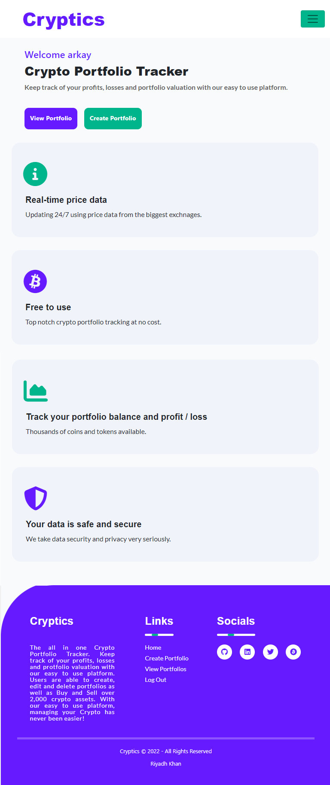

# Cryptics - Crypto Portfolio Tracking Application

Cryptics is a website which allows users to track and monitor their cryptocurrency holdings. Users are able to create multiple portfolios where they can buy and sell coins and track the profitability and performance of their holdings.  

Cryptics is a Full Stack Application built with the Django Framework which includes full CRUD functionality allowing users to Sign Up / Log In to their account and Add, Edit or Delete portfolios and coins and track their cryptocurrency holdings all in one application.

[Cryptics - Deployed Site](https://cryptics-portfolio-tracker.herokuapp.com/)

---


---

# User Experience (UX)
 
* ## Vision      
    My vision for Cryptics is to be an application crypto enthusiasts go to if they want to manage their portfolios and track the performance of them. The website is meant to be simple yet effective and provide a real use case to people interested in cryptocurrency. The website will be easy to navigate and I will take a mobile first approach when developing the user interface for the application. I want Cryptics to be responsive and to provide all the necessary features expected in a portfolio tracking application.

* ## Aims
    To provide users an easy to use application they can go to when they want to track and manage their cryptocurrency holdings.  
 
* ## Target Audience
    Cryptocurrency is for everyone! However, the program does require users to have a basic understanding about crypto and portfolio management. Additionally, in the UK you must be at least 18 to own crypto assets as a result, my target audience is for cryptocurrency enthusiasts 18+.
 
* ## User Stories

1. As a **Site User** I will be **directed to the Home Page** so that **I can understand the website**
2. As a **Site User** I can **create an account** so that **I can create a portfolio**
3. As a **Site User** I can **log in to my account** so that **I can view my portfolios**
4. As a **Site User** I can **create a Portfolio** so that **I can track my crypto holdings**
5. As a **Site User** I can **view all Portfolios** so that **I can see the total valuation**
6. As a **Site User** I can **delete my Portfolio** so that **I can remove my portfolio**
7. As a **Site User** I can **search for a token** so that **I can add it to my portfolio**
8. As a **Site User** I can **Sell a token** so that **I can remove it from portfolio**
9. As a **Site User** I can **Buy a token** so that **I can add to my portfolio**


* ## Development Method
    When developing Cryptics I will take an Agile Approach. Meaning I will take an iterative approach to project management and software development helping me to deliver value faster and speed up development time. I will focus on working software over comprehensive documentation and responding to change over following a plan when creating the project. 

    I will also intergrate the MoSoCoW method which is a four-step approach to prioritizing which project requirements will provide the best return on investment (ROI). MoSCoW stands for Must Have, Should Have, Could Have and Wont Have. Using this method, I am able to label and order my User Stories into four categories, allowing me to know which ones to focus on and to ensure I meet my project vision and aims. 

* ## Structure
    Cryptics will be developed using Django, as a result I will split the program functionality into separate apps. A Django application is a Python package that is specifically inteded for use in a Django project. For my project I will create two apps; Home and Portfolio

    Home: This app will contain the code the user will see when they launch the application. It will contain all of the necessary urls and views in order to render the Homepage of Cryptics. This app will also be home to the [base.html](home/templates/home/base.html) and [index.html](home/templates/home/index.html) page which contains the code for the landing page of the project.

    Portfolio: This app will contain all the code needed in order to get the Portfolio functionality working. It will contain the urls and views in order to get the CRUD functionality working allowing users to ADD/BUY/SELL coins to their portfolios. It will also contain all of the code necessary in order to get the API working so the site can display live price data. It will contain the [templates](portfolio/templates) needed to display the Portfolio and Assets section of the site. 
 
## Design

* ### Wireframes

    
    
    

* ### ERD Diagram

    

    When creating the database for the website I had to consider the all the data I needed to store in order to have a functioning portfolio tracker. I came to the conclusion that I would need three different relational databases which would interact with one another. The first is the default Django User database, which would store the usernames and passwords of all users which would allow them to login to the site and create portfolios and add tokens. As I didn't need any extra functionality I did not add any custom fields to the database which meant I did not have to add it to my models. 

    The next database is the Portfolio database which had a primary key of PortfolioID, as well as a ForeignKey relationship to the Users database. The database also had two extra fields being Name (which was the name of the Portfolio), Created On (the date it was created). This database is the building blocks for the others, as without it, users would be unable to add any assets to their Portfolio so it is vital it contains all the necessary data. The Portfolio database can be found [here](https://github.com/RiyadhKh4n/cryptics/blob/main/portfolio/models.py#L5) 

    The final database I created was the Assets database, this would be responsible for holding all the data about a single asset within a single portfolio. This meant, whenever a user wanted to add a new coin to their database, a new instance of the Asset model would be created which would hold all relevant data about that particular coin. The relationship between the Portfolio -> Assets database is a zero-to-many as one portfolio could have zero or many assets within. The model contains a PrimaryKey of AssetID as well as a ForeignKey relationship with Portfolio which would allow the individual asset to be connect to a particular portfolio. It also contains several other fields which hold data necessary in order to calculate profit and loss for the particular asset. Quantity (the amount of coins), AveragePrice (the average price of each coin bought - which is a JSONField), USDSpent (total amount of USD spent to purchase coins), USDEarned (profit gained from selling x amount of coins) and finally added_to_portfolio (date the asset was added to the portfolio). The Assets database can be found [here](https://github.com/RiyadhKh4n/cryptics/blob/main/portfolio/models.py#L18) 

* ### Colour Scheme

    When designing Cryptics I wanted to ensure the colour scheme of my site was visually appealing, I did this by first chosing the main colour which I wanted the majoirty of the site to have. I then used [ColorSpace](https://mycolor.space/) to find colours which compliment it. I decided to go with #661AFF as my primary colour as purple is my favourite colour and I liked the shade of it. By using ColorSpace I chose the Matching Palette which I found most visually appealing which led to my secondary colour being #00B58B, and #B0A8B9 being the tertiary colour. When implementing colours into the site, I went with the 60/30/10 rule which meant #661AFF would make up 60% of the site being the more dominant colour, #00B58B would make up 30% and #B0A8B9 making up 10% being used for accents. Regarding text, black and white were used as these lead to the most readability as well as using white for the background of the pages as I wanted to my site to look professional and not tacky. The colour pallete of the site can be seen below:

    

* ### Typography

    When considering the typography of the site, I wanted to use fonts that were readable, professional and easy on the eye. As a result, for the main headings I went with [Fjalla One](https://fonts.google.com/specimen/Fjalla+One?preview.text=Cryptics&preview.text_type=custom&query=Fja), with Sans-Serif as the fall-back font in case it was not supported by a web browser. For all other text on the website I went with [Lato](https://fonts.google.com/specimen/Lato?query=Lato) as I feel that is compliments Fjalla One nicely and conforms to the three points I set out when chosing the typography for Cryptics.

* ### Icons

    All icons used in the website were taken from [fontawesome](https://fontawesome.com/start)

    - #### Favicon

        The favicon for the site was created with [favicon.cc](https://www.favicon.cc/) 
 
# Features
 
Here describes the main features of the website and what the user can expect when viewing ~
 
## Existing Features:

Cryptics has several features:

- Cryptics has a full user authentication system which allows users to Create an Account or Login to the platform in order to begin using the Portfolio Tracking features. Users must have an account in order to use the features of the site as all Portfolio / Coin data must be saved to that users account, resulting in the user needing an account.

- Onced logged in, users are able to create, read, edit and delete portfolios which they can add unlimited crypto assets to, allowing them to keep track of their holdings and monitor profit and losses. Within each portfolio, users are able to Buy and Sell thousands of coins giving them a platform to track their coins and help make better investment decisons.  

### Homepage:



### Log In / Create Account / Sign Out


### View Portfolios:


### Create a Portfolio:


### Edit and Delete Portfolios:


### View Assets:


### ADD coins:


## Future Features:

- A future feature Cryptics could have, is the ability to visually see the performance of each portfolio and all portfolios as a whole via a line graph which shows the change in USD value over time. This was a feature I wanted to include in this iteration of development however due to lack of time I was not able to intergrate this feature.

- Another feature would be to allow users to submit a contact form in order to provide feedback on the site and to raise any issues they had when using Cryptics. Although I did want to implement this, I decided not to as I wanted to focus on the core functionality first. 

- Cryptics could allow users to login via social media platforms like Facebook or Google, as well as a password reset functionality, however due to the added compleity of this, I decided not to intergrate it into the site. However it is definately a future feature I would like to implement.

- In future iterations of the project, I would like to implement JavaScript in order to add more interactivity and functionality to the site. This would help make Cryptics more engaging and improve the professionalism of the website.
 
# Technologies
## Programming Languages:

- [HTML](https://developer.mozilla.org/en-US/docs/Learn/Getting_started_with_the_web/HTML_basics) - The HyperText Markup Language or HTML is the standard markup language for documents designed to be displayed in a web browser

- [CSS](https://en.wikipedia.org/wiki/CSS) - Cascading Style Sheets is a style sheet language used for describing the presentation of a document

- [Python](https://www.python.org/) - Python is an interpreted high-level general-purpose programming language. It is used when creating the backend functionality in Django
 
I used two GitHub [Project Boards](https://github.com/RiyadhKh4n/cryptics/projects) to keep track of all the User Stories and Tasks necessary in order to build Cryptics

- The [User Story Project Board](https://github.com/RiyadhKh4n/cryptics/projects/1) was used to keep track of my User Stories and ensure I implemented all the functionality I set out to implement. I used the MoSCoW method to prioritize which project requirements will provide the best user experience.

- The [Development Project Board](https://github.com/RiyadhKh4n/cryptics/projects/2) was used to keep track of the different parts of development. It is more code-focused and describes the parts of the project I had to complete in order to meet my User Stories as well as any bugs that I fixed. 
 
## Frameworks

1. [Django](https://www.djangoproject.com/)
    * Django is a Python-based free and open-source web framework that follows the model–template–views architectural pattern.

2. [Bootstrap](https://getbootstrap.com/)
    * Bootstrap is a free and open-source CSS framework directed at responsive, mobile-first front-end web development.

3. [Oauthlib](https://github.com/oauthlib/oauthlib)
    * OAuthLib is a framework which implements the logic of OAuth1 or OAuth2 without assuming a specific HTTP request object or web framework.

## Libraries 

1. [Os Library](https://docs.python.org/3/library/os.html)
    * Used to clear the console.

2. [Requests](https://pypi.org/project/requests/)
    * Allowed me to send HTTP requests without having to manually add query to strings to the URLs.

3. [dj-database-url](https://pypi.org/project/dj-database-url/)
    * This simple Django utility allows you to utilize the 12factor inspired DATABASE_URL environment variable to configure your Django application.
 
4. [asgiref](https://github.com/django/asgiref)
    * ASGI is a standard for Python asynchronous web apps and servers to communicate with each other, and positioned as an asynchronous successor to WSGI.

5. [django-allauth](https://django-allauth.readthedocs.io/en/latest/)
    * Integrated set of Django applications addressing authentication, registration, account management as well as 3rd party (social) account authentication.

6. [gunicorn](https://gunicorn.org/)
    * The Gunicorn "Green Unicorn" is a Python Web Server Gateway Interface HTTP server.

7. [psycopg2](https://pypi.org/project/psycopg2/)
    * Psycopg is the most popular PostgreSQL database adapter for the Python programming language. 

8. [PyJWT](https://pyjwt.readthedocs.io/en/latest/)
    * PyJWT is a Python library which allows you to encode and decode JSON Web Tokens (JWT).

9. [sqlparse](https://pypi.org/project/sqlparse/)
    * Sqlparse is a non-validating SQL parser for Python. It provides support for parsing, splitting and formatting SQL statements.

10. [whitenoise](http://whitenoise.evans.io/en/stable/)
    * With a couple of lines of config WhiteNoise allows your web app to serve its own static files, making it a self-contained unit that can be deployed anywhere without relying on nginx, Amazon S3 or any other external service.

## Programs Used:
 
1. [GitPod](https://www.gitpod.io/):
    * GitPod was the IDE used to create the site
 
2. [Git](https://git-scm.com/):
    * Git was used for version control by utilizing the Gitpod terminal to commit to Git and Push to GitHub.
 
3. [GitHub](https://github.com/):
    * GitHub is used to store the projects code after being pushed from Git.
 
4. [Google Developer Tools](https://developer.chrome.com/docs/devtools/):
    * Used to test the program throughout development
 
5. [Heroku](https://dashboard.heroku.com/login):
    * Used to Deploy the Project
 
6. [AMiResponsive](http://ami.responsivedesign.is/):
    * To generate the image at the beginning of the README
 
7. [TinyPNG](https://tinypng.com/):
    * This was used to compress all images used in the README.md
 
8. [PEP8](http://pep8online.com/):
    * Used to validate my Python code
 
9. [favicon.cc](https://www.favicon.cc/):
    * Used to create the favicon

10. [HerokuSQL](https://www.heroku.com/postgres):
    * Database used for deployed project

11. [Balsamiq](https://balsamiq.com/wireframes/):
    * Used to create Wireframes

12. [SmartDraw](https://www.smartdraw.com/): 
    * Used to create ERD diagrams

13. [ColorSpace](https://mycolor.space/):
    * Used to find the colour scheme of the site

14. [W3C Markup Validation Service](https://validator.w3.org/):
    * Used to validate HTML code

15. [W3C CSS Validation Service](https://jigsaw.w3.org/css-validator/):
    * Used to validate CSS
 
# Testing
 
Due to the size of the testing section for Cryptics I have created [TESTING.md](TESTING.md). It contains all my validator testing, lighthouse scores, Django Testing, User Story Testing, Manual Tests, Responsiveness Tests, Browser Compatibility Tests as well as any bugs.
 
[Link To TESTING.md](TESTING.md)
   
# Deployment
 
Deploying the project using Heroku:

1. Login to [Heroku](https://dashboard.heroku.com/apps) and Create a New App

2. Give the App a name, it must be unique, and select a region closest to you

3. Click on 'Create App', this will take you to a page where you can deploy your project

4. Click on the 'Resources' tab and search for 'Heroku Postgres' as this is the add-on you will use for the deployed database

5. Click on the 'Settings' tab at the top of the page. The following step must be completed before deployment. 

6. Scroll down to 'Config Vars' and click 'Reveal Config Vars'. Here the database URL is stored, it is the connection to the database, so this must be copied and stored within env.py as a root level file.

The env.py files is where the projects secret environment variables are stored. This file is then added to a gitnore file so it isn't stored publicly within the projects repository.

7. Next, the secret key needs to be created within the projects env.py file on GitPod and then added to the Config Vars on Heroku. Once added, go to the settings.py file on GitPod.

8. Within the [settings.py](settings.py) file you need to import several libraries:
    ```python
    import os
    import dj_database_url
    from django.contrib.messages import constants as messages
    if os.path.isfile('env.py'):
        import env
    ```

9. Then, we need to replace the current insecre secret key with ```os.environ.get('SECRET_KEY)'```, that we set witin the env.py file.

10. Once the secret key is replaced, scroll down to DATABASES to connect to the Postgres database. Comment out the current code and add the following python dictionary: 
```python
DATABASES = { 'default': dj_database_url.parse(os.environ.get('DATABASE_URL')) }
```

11. The next step is to connect the project to whitenoise, which is where the static files will be stored. You can find a full explanation of how to install whitenoise [here](http://whitenoise.evans.io/en/stable/)

12. Then on Heroku add to the Config Vars, DISABLE_COLLECTSTATIC = 1, as a temporary measure to enable deployment without any static files, this will be removed when it is time to deploy the full project.

13. Next we need to tell Django where to store the madia and static files. Towards the bottom of settings.py file we can add:

```python
STATIC_URL = '/static/'
STATICFILES_DIRS = [os.path.join(BASE_DIR, 'static')]
STATIC_ROOT = os.path.join(BASE_DIR, 'staticfiles')
MEDIA_URL = '/media/'
```

14. Then we need to tell Django where the templates will be stored. At the top of settings.py, under BASE_DIR (the base directory), add a templates directory and then scroll down to TEMPLATES and add the templates directory variable to 'DIRS': [].

15. Now we have to add our Heroku Host Name into allowed hosts in settings.py file:

```python
ALLOWED_HOSTS = ['YOUR-APP-NAME-HERE', 'localhost']
```

16. Finally, to complete the first deployment set up of the skeleton app, create a Procfile so that Heroku knows how to run the project. Within this file add the following: web: gunicorn APP-NAME.wsgi Web tells Heroku to allow web traffic, whilst gunicorn is the server installed earlier, a web services gateway interface server (wsgi). This is a standard that allows Python services to integrate with web servers.

17. Now, go to the 'Deploy' Tab on Heroku. Find the 'Deployment Method' section and choose GitHub. Connect to your GitHub account and find the repo you want to deploy. 

18. Scroll down to the Automatic and Manual Deploys sections. Click 'Deploy Branch' in the Manual Deploy section and waited as Heroku installed all dependencies and deployed the code.

21. Once the project is finnished deploying, click 'Open App' to see the newly deployed project.

22. Before deploying the final draft of your project you must:

- Remove staticcollect=1 from congifvars within Heroku
- Ensure DEBUG is set to false in settings.py file or:
  Set DEBUG to development with: development = os.environ.get('DEVELOPMENT', False) above it.

## Making a Local Clone
 
1. Log in to GitHub and locate the [GitHub Repository](https://github.com/RiyadhKh4n/cryptics)
2. Under the repository name, click "Clone or download".
3. To clone the repository using HTTPS, under "Clone with HTTPS", copy the link.
4. Open Git Bash
5. Change the current working directory to the location where you want the cloned directory to be made.
6. Type `git clone`, and then paste the URL you copied in Step 3.
 
    $ `https://github.com/RiyadhKh4n/cryptics.git`
 
7. Press Enter. Your local clone will be created.
 
```shell
$ git clone https://github.com/RiyadhKh4n/cryptics.git
> Cloning into `CI-Clone`...
> remote: Counting objects: 10, done.
> remote: Compressing objects: 100% (8/8), done.
> remove: Total 10 (delta 1), reused 10 (delta 1)
> Unpacking objects: 100% (10/10), done.
```
 
Alternatively, if using Gitpod, you can click below to create your own workspace using this repository.
 
[](https://gitpod.io/#https://github.com/RiyadhKh4n/cryptics)

You will need to also install all required packages in order to run this application on Heroku, refer to [requirements.txt](requirements.txt)
* Command to install this apps requirements is `pip3 install -r requirements.txt`
 
# Credits

## Code

The code which calls the CoinMarketCap API was taken from my previous project [CoinFrog](https://github.com/RiyadhKh4n/CoinFrog)

The code for the footer was inspired from [this](https://www.youtube.com/watch?v=FRRlFLfdvBE) YouTube video

The code for the table styling was inspired from [this](https://www.youtube.com/watch?v=2yoXvzonxpA) YouTube video

### Acknowledgements
* Tim Nelson - My Mentor
* Tutor Support
* Slack community
 
