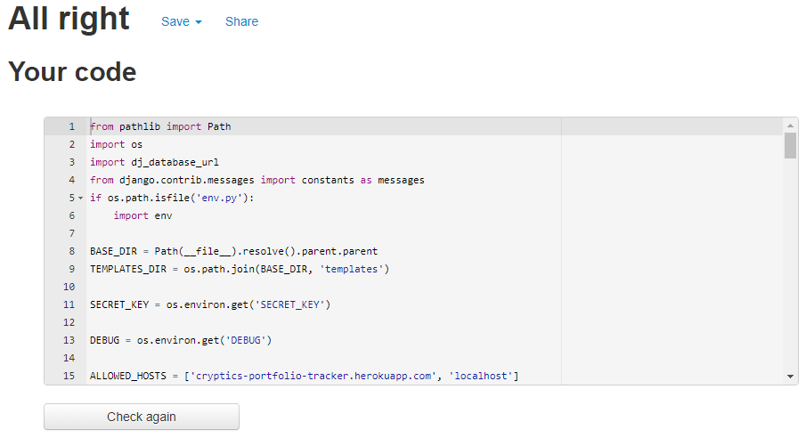

# Testing

## Validator Testing 
[Python Validator](http://pep8online.com/)

### Views.py:

#### Portfolio APP:

#### Main APP:

### Models.py:

### Forms.py:

### Urls.py

#### Main APP:

#### Home APP:

#### Portfolio APP:

### Settings.py

## [HTML Validation](https://validator.w3.org/)

## [CSS Validation](https://jigsaw.w3.org/css-validator/)

The errors which can be seen on the screen shot below are coming from Front-Awesome, not my project, so can be ignored.

## Lighthouse Score

### Mobile:

### Desktop:

## Django Testing (Unit Tests)

## User Story Tests

1. As a **Site User** I will be **directed to the Home Page** so that **I can understand the website**

    When the user loads the site, they are taken to this page which is the homepage. Here they are able to get an understanding of what Cryptics is and the aim of the website, they are also prompted to Create an Account, which allows them to use the Portfolio Tracking features. 

    

2. As a **Site User** I can **create an account** so that **I can create a portfolio**

    Once the user has created an account, they are able to create and view their portfolios, as well as add assets to them.

    

3. As a **Site User** I can **log in to my account** so that **I can view my portfolios**

    Once an account has been created, users are able to login to their account on any device and view their portfolios as well as individual assets

    

4. As a **Site User** I can **create a Portfolio** so that **I can track my crypto holdings**

    Cryptics provides full portfolio tracking functionality, meaning once a portfolio has been created, they are then able to add assets to them, allowing them to track their crypto holdings.

    

5. As a **Site User** I can **view all Portfolios** so that **I can see the total valuation**

    As well as being able to view individual assets within a portfolio, Cryptics also allows user to view all portfolios and see the total USD valuation of them.

    

6. As a **Site User** I can **delete my Portfolio** so that **I can remove my portfolio**

    Cryptics has full CRUD functionality meaning users have full control over the creation, reading, updating and deletion of their portfolios and assets.

    

7. As a **Site User** I can **search for a token** so that **I can add it to my portfolio**

    Cryptics harnesses the power of the CoinMarketCap API allowing users to search for and add over 2000 cryptocurrencies to their portfolios with live price data.

    

8. As a **Site User** I can **Sell a token** so that **I can remove it from portfolio**

    Users have the ability to Buy and Sell thousands of coins and track their holdings all in one platform.

    

9. As a **Site User** I can **Buy a token** so that **I can add to my portfolio**

    Users have the ability to Buy and Sell thousands of coins and track their holdings all in one platform.

    

## Manual Testing

TO DO

## Responsiveness Testing

### Homepage:

### 320px & 375px:

### 425px:

### 768px:

### 1024px:

### 1440px:

### Login, Create Account & Logout:

### 320px & 375px:

### 425px:

### 768px, 1204px & 1440px:

### View Portfolio:

### 320px & 375px:

### 425px:

### 768px:

### 1024px & 1440px:

### Create Portfolio:

### 320px, 375px % 425px:

### 768px:

### 1024px & 1440px:

### Manage Portfolio Modal:

### 320px & 375px:

### 425px:

### 768px:

### 1024px & 1440px:

### View Assets:

### 320px & 375px:

### 425px:

### 768px:

### 1024px & 1440px:

### Add Coin Form:

### 320px & 375px:

### 425px:

### 768px and above:

## Browser Compatibility Tests 

I will test Cryptics on [Firefox](https://www.mozilla.org/en-GB/firefox/new/), [Microsoft Edge](https://www.microsoft.com/en-us/edge) and [Brave Browser](https://brave.com/):

### Firefox:

### Microsoft Edge:

### Brave Browser:

## Bugs

- Not so much a bug but the API I am using only allows 333 calls per day as I am using the free version. Each time the user Adds or Buys a coin, as well as each time the [portfolio.html](portfolio/templates/portfolio/portfolio.html) template is rendered, 10 credits (calls) are used which means the program can be called 33 times a day before going over the limit. The limit is a soft limit meaning it does let you go over the 333 per day however after 10,000 calls (per month) the API will stop allowing calls meaning the program would not work if the limit is reached.

- A bug that is out of my control is if the CoinMarketCap data has been hacked or corrupted. This was not something I thought I had to worry about however on (14/12/21) the website got hacked causing all the coin data to be incorrect, meaning if the data my program produces will also be incorrect.

- If a user adds a coin whose price is very small e.g. SHIB (£0.00001852), the program will add the coin as price £0. This is because I round the price displayed to 3 decimal places in order to reduce how many decimal places display on the front-end making the site look cleaner. However, this will cause all other fields which depend on price (current_holdings, average_price, pnl) to also equal £0 as anything multiplied by zero equals zero. As a result, the asset will not display the correct data on the table in [assets.html](portfolio/templates/portfolio/assets.html)

