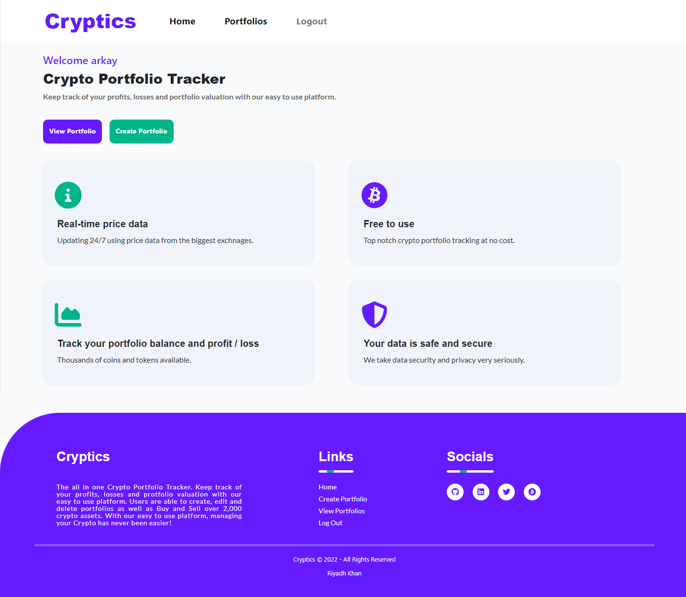
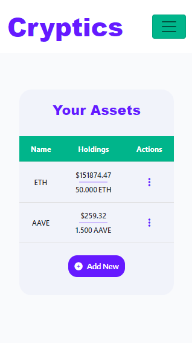

# Testing

## Validator Testing 
[PEP8 Python Validation](http://pep8online.com/)

### Views.py:

#### Portfolio APP:


#### Main APP:


### Models.py:


### Forms.py:


### Urls.py

#### Main APP:


#### Home APP:


#### Portfolio APP:


### Settings.py


## [HTML Validation](https://validator.w3.org/)


## [CSS Validation](https://jigsaw.w3.org/css-validator/)

The errors which can be seen on the screen shot below are coming from Front-Awesome, not my project, so can be ignored.


## Lighthouse Score

### Mobile:


### Desktop:


## Django Testing (Unit Tests)

I have used Django TestCase for automated testing:

### Testing Forms:

- Test the PortfolioForm() used when a user creates a new portfolio:

```python
class TestPortfolioForm(TestCase):

    def test_portfolio_name_is_required(self):
        form = PortfolioForm({'name': ''})
        self.assertFalse(form.is_valid())
        self.assertIn('name', form.errors.keys())
        self.assertEqual(form.errors['name'][0], 'This field is required.')

    def test_field_are_explicit_in_form_metaclass(self):
        form = PortfolioForm()
        self.assertEqual(form.Meta.fields, ['name'])
```

- Test the AddAsset() form used for when a user ADDs a new coin to their portfolio:

```python
class TestAddAssetForm(TestCase):

    def test_portfolio_name_is_required(self):
        form = AddAsset({'quantity': ''})
        self.assertFalse(form.is_valid())
        self.assertIn('quantity', form.errors.keys())
        self.assertEqual(form.errors['quantity'][0], 'This field is required.')

    def test_field_are_explicit_in_form_metaclass(self):
        form = AddAsset()
        self.assertEqual(form.Meta.fields, ['quantity'])
```

- Test the UpdateAsset() form used when a user BUY/SELL a coin:

```python
class TestUpdateAssetForm(TestCase):

    def test_portfolio_name_is_required(self):
        form = UpdateAsset({'quantity': ''})
        self.assertFalse(form.is_valid())
        self.assertIn('quantity', form.errors.keys())
        self.assertEqual(form.errors['quantity'][0], 'This field is required.')

    def test_field_are_explicit_in_form_metaclass(self):
        form = UpdateAsset()
        self.assertEqual(form.Meta.fields, ['quantity'])
```

#### Results:


### Testing Urls:

- Test Get Portfolio List url which is called when the user views their portfolios:

```python
class TestPortfolioUrls(TestCase):
    def test_getPortfolioList_url_is_resolved(self):
        url = reverse('get_portfolio_list')
        self.assertEquals(resolve(url).func, get_portfolio_list)
```

- Test Edit Portfolio url which is called when the user wants to edit the portfolio name:

```python
def test_editPortfolio_url_is_resolved(self):
        url = reverse('edit_portfolio', args=[1])
        self.assertEqual(resolve(url).func, edit_portfolio)
```

- Test Delete Portfolio url which is called when a portfolio is deleted:

```python
def test_deletePortfolio_url_is_resolved(self):
        url = reverse('delete_portfolio', args=[1])
        self.assertEqual(resolve(url).func, delete_portfolio)
```

- Test Create Portfolio url which is called when a portfolio is created:

```python
def test_createPortfolio_url_is_resolved(self):
        url = reverse('create_portfolio_url')
        self.assertEquals(resolve(url).func, create_portfolio)
```

- Test View url which is called when the user clicks on a portfolio to view its assets:

```python
def test_viewPortfolio_url_is_resloved(self):
        url = reverse('get_asset_list', args=[1])
        self.assertEquals(resolve(url).func, get_asset_list)
```

- Test Get url which is called when the user ADDs a coin:

```python
 def test_get_url_is_resolved(self):
        url = reverse('get_asset', args=[1])
        self.assertEquals(resolve(url).func, get_asset)
```

- Test Add url which is called when a user ADDs a coin:

```python
def test_add_url_is_resolved(self):
        url = reverse('add_asset_form', args=[1, 'ADA', '10.00'])
        self.assertAlmostEquals(resolve(url).func, add_asset)
```

- Test Update which is called when a user BUY/SELL a coin:

```python
def test_update_url_is_resolved(self):
        url = reverse('update_asset', args=[1, 'sell', 'ADA', '0.89'])
        self.assertAlmostEquals(resolve(url).func, update_asset)
```

#### Results:


### Testing Views:

- Test 404 Handler View:

```python
class TestHandler404(TestCase):
    def test_404_page(self):
        response = self.client.get('/handler404')
        self.assertEqual(response.status_code, 404)
        self.assertTemplateUsed(response, 'errors/404.html')
```

#### Results:


Views within the Portfolio App have been partially tested:

- Test get_portfolio_list:

```python
def test_get_portfolio_list(self):
        response = self.client.get('/')
        self.assertEqual(response.status_code, 200)
        self.assertTemplateUsed(response, 'home/index.html')
```

- Test create_portfolio renders correct template:

```python
def test_create_portfolio(self):
        url = reverse('create_portfolio_url')
        response = self.client.get(url)
        self.assertEqual(response.status_code, 200)
        self.assertTemplateUsed(response, 'portfolio/create_portfolio.html')
```

- Test create_portfolio submits the form correctly:

```python
def test_create_portfolio_form(self):
        url = reverse('create_portfolio_url')
        john = User.objects.get(username='john')
        response = self.client.post(
            url, {"name": "ftx", "slug": "ftx", "user": john})
        count = Portfolio.objects.count()
        self.assertEqual(count, 1)
```

#### Results:


## User Story Tests

1. As a **Site User** I will be **directed to the Home Page** so that **I can understand the website**

    When the user loads the site, they are taken to this page which is the homepage. Here they are able to get an understanding of what Cryptics is and the aim of the website, they are also prompted to Create an Account, which allows them to use the Portfolio Tracking features. 

    

2. As a **Site User** I can **create an account** so that **I can create a portfolio**

    Once the user has created an account, they are able to create and view their portfolios, as well as add assets to them.

    

3. As a **Site User** I can **log in to my account** so that **I can view my portfolios**

    Once an account has been created, users are able to login to their account on any device and view their portfolios as well as individual assets

    

4. As a **Site User** I can **create a Portfolio** so that **I can track my crypto holdings**

    Cryptics provides full portfolio tracking functionality, meaning once a portfolio has been created, they are then able to add assets to them, allowing them to track their crypto holdings.

    


5. As a **Site User** I can **view all Portfolios** so that **I can see the total valuation**

    As well as being able to view individual assets within a portfolio, Cryptics also allows user to view all portfolios and see the total USD valuation of them.

    

6. As a **Site User** I can **delete my Portfolio** so that **I can remove my portfolio**

    Cryptics has full CRUD functionality meaning users have full control over the creation, reading, updating and deletion of their portfolios and assets.

    

7. As a **Site User** I can **search for a token** so that **I can add it to my portfolio**

    Cryptics harnesses the power of the CoinMarketCap API allowing users to search for and add over 2000 cryptocurrencies to their portfolios with live price data.

    


8. As a **Site User** I can **Sell a token** so that **I can remove it from portfolio**

    Users have the ability to Buy and Sell thousands of coins and track their holdings all in one platform.

    

9. As a **Site User** I can **Buy a token** so that **I can add to my portfolio**

    Users have the ability to Buy and Sell thousands of coins and track their holdings all in one platform.

    

## Manual Testing

Manual testing is the process of manually testing software for defects. It requires a tester to play the role of an end user where by they use most of the application's features to ensure correct behaviour.

- As I am using django-allauth, it handles the login / create an account functionality ensuring users only enter the correct infomration before they can progress. It ensures duplicate users cannot be created, passwords are not too similar / short as well as all information is validated before users can submit.

    

- When users try ADD a coin to a portfolio, the application will ensure the ticker they enter is valid. If it does not exist within the CoinMarketCap API then a Bootstrap message will display telling them that the ticker they entered does not exist. Furthermore, when submitting the inital form, all tickers must be entered in uppercase. If the user does not do this, it would cause the API call to fail, so I made sure that all valid tickers entered are transformed to uppercase before the next form can be submit.

    

- When trying to SELL a coin, user's should not be able to sell more than they hold. As a result I have put in code which checks if the quantity they are trying to sell is less or equal to the quantity they hold. If this check fails, then a Bootstrap message will appear letting the user know, and the form will not submit.

    

- If a user tries to ADD a coin which they already hold in their portfolio, instead of creating a new instance of that coin, the updated quantity and price bought at should be appended to the existing assets fields. This is because you should not have mulitple instances of the same coin within a single portfolio.

    

- A user is unable to name a portfolio anything greater than nine characters, this is because on mobile, due to the portfolio information being stored on a ```<table>```, if the name is greater than nine chars it will cause an overflow error. As a result, in the model, I defined max_length = 9.

    

## Responsiveness Testing

### Homepage:

### 320px & 375px:


### 425px:


### 768px:


### 1024px:


### 1440px:



### Login, Create Account & Logout:

### 320px & 375px:


### 425px:


### 768px, 1204px & 1440px:


### View Portfolio:

### 320px & 375px:


### 425px:


### 768px:


### 1024px & 1440px:


### Create Portfolio:

### 320px, 375px % 425px:


### 768px:


### 1024px & 1440px:


### Manage Portfolio Modal:

### 320px & 375px:


### 425px:


### 768px:


### 1024px & 1440px:


### View Assets:

### 320px & 375px:



### 425px:


### 768px:


### 1024px & 1440px:


### Add Coin Form:

### 320px & 375px:


### 425px:


### 768px and above:


## Browser Compatibility Tests 

I will test Cryptics on [Firefox](https://www.mozilla.org/en-GB/firefox/new/), [Microsoft Edge](https://www.microsoft.com/en-us/edge) and [Brave Browser](https://brave.com/):

### Firefox:


### Microsoft Edge:


### Brave Browser:


## Bugs

- Not so much a bug but the API I am using only allows 333 calls per day as I am using the free version. Each time the user Adds or Buys a coin, as well as each time the [portfolio.html](portfolio/templates/portfolio/portfolio.html) template is rendered, 10 credits (calls) are used which means the program can be called 33 times a day before going over the limit. The limit is a soft limit meaning it does let you go over the 333 per day however after 10,000 calls (per month) the API will stop allowing calls meaning the program would not work if the limit is reached.

    

- A bug that is out of my control is if the CoinMarketCap data has been hacked or corrupted. This was not something I thought I had to worry about however on (14/12/21) the website got hacked causing all the coin data to be incorrect, meaning if the data my program produces will also be incorrect.

- If a user adds a coin whose price is very small e.g. SHIB (£0.00001852), the program will add the coin as price £0. This is because I round the price displayed to 3 decimal places in order to reduce how many decimal places display on the front-end making the site look cleaner. However, this will cause all other fields which depend on price (current_holdings, average_price, pnl) to also equal £0 as anything multiplied by zero equals zero. As a result, the asset will not display the correct data on the table in [assets.html](portfolio/templates/portfolio/assets.html)


